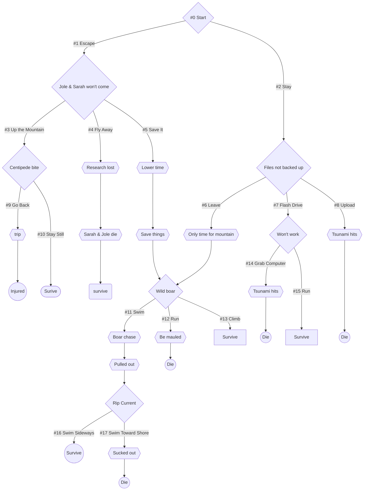

# Uilm

  

  
  
  
  ![Twine](https://img.shields.io/badge/twine-%23232323.svg?style=for-the-badge&logo=data:image/svg+xml;base64,PHN2ZyB4bWxucz0iaHR0cDovL3d3dy53My5vcmcvMjAwMC9zdmciIHdpZHRoPSIxIiBoZWlnaHQ9IjEiPjxkZWZzPjxsaW5lYXJHcmFkaWVudCBpZD0iYSIgeDE9IjI1NiIgeDI9IjIzMS45ODciIHkxPSIwIiB5Mj0iNzI1LjU0OCIgZ3JhZGllbnRUcmFuc2Zvcm09Im1hdHJpeCguMDAwODMgMCAwIC4wMDA4MyAuMDczIC4wNzMpIiBncmFkaWVudFVuaXRzPSJ1c2VyU3BhY2VPblVzZSI+PHN0b3Agb2Zmc2V0PSIwIiBzdHlsZT0ic3RvcC1jb2xvcjojMTI3YWVlO3N0b3Atb3BhY2l0eToxIi8+PHN0b3Agb2Zmc2V0PSIxIiBzdHlsZT0ic3RvcC1jb2xvcjojMTE3YWVmO3N0b3Atb3BhY2l0eTouMjUwOTgiLz48L2xpbmVhckdyYWRpZW50PjxsaW5lYXJHcmFkaWVudCBpZD0iYiIgeDE9IjUyIiB4Mj0iOTcyIiB5MT0iNjA0LjM2MiIgeTI9IjYwNC4zNjIiIGdyYWRpZW50VHJhbnNmb3JtPSJtYXRyaXgoLjAwMDgzIDAgMCAuMDAwODMgLjA3MyAuMDUpIiBncmFkaWVudFVuaXRzPSJ1c2VyU3BhY2VPblVzZSI+PHN0b3Agb2Zmc2V0PSIwIiBzdHlsZT0ic3RvcC1jb2xvcjojMTBmMDVlO3N0b3Atb3BhY2l0eTouMjUwOTgiLz48c3RvcCBvZmZzZXQ9IjEiIHN0eWxlPSJzdG9wLWNvbG9yOiMxMGYwNWU7c3RvcC1vcGFjaXR5OjEiLz48L2xpbmVhckdyYWRpZW50PjwvZGVmcz48cGF0aCBkPSJNLjEyNS4wNzRoLjMydi44NTJoLS4zMlptMCAwIiBzdHlsZT0ic3Ryb2tlOm5vbmU7ZmlsbC1ydWxlOm5vbnplcm87ZmlsbDp1cmwoI2EpIi8+PHBhdGggZD0iTS4xMjUuNzY2Qy4xMjUuMTguODc1LjE4Ljg3NS4xOFYuNXMtLjQzIDAtLjQzLjI2NnYuMTZoLS4zMlptMCAwIiBzdHlsZT0ic3Ryb2tlOm5vbmU7ZmlsbC1ydWxlOm5vbnplcm87ZmlsbDp1cmwoI2IpIi8+PC9zdmc+)
   
   ![Harlowe](https://img.shields.io/badge/harlowe-%23ccc?style=for-the-badge&logo=data:image/svg+xml;base64,PHN2ZyB4bWxucz0iaHR0cDovL3d3dy53My5vcmcvMjAwMC9zdmciIHdpZHRoPSIxIiBoZWlnaHQ9IjEiPjxwYXRoIGQ9Im0uNDM0LjY5NS0uMjUuMDQ3LjEwMS4wNjMuMDQ3LS4wMDhoLjAyM1EuMzYuNzkuMzcxLjc5N3YuMDA4SC4zNTVMLjIyMy44MjhsLS4wNC4wMDhDLjE3Ny44MzYuMTc3LjgzMi4xNzcuODMyTC4yMzguODE2LjAyLjdsLS4wMjQuMDA4SC0uMDJMLS4wMzUuNjk1cS0uMDA2IDAgMCAwUS0uMDM0LjY5LS4wMjcuNjg4TC4wOS42NjRoLjAzOXYuMDA4Qy4xMjkuNjguMTI1LjY4LjExMy42OEwuMDY2LjY5bC4xMDIuMDQzLjI1LS4wNDMtLjEwMi0uMDUtLjA1NC4wMTVILjIzOEwuMjMuNjQ4SC4yMjNTLjIyNy42NDEuMjM4LjY0MUwuMzU1LjYxN2guMDQ3TC4zOTUuNjNDLjM5NS42MzMuMzkuNjM3LjM3OS42MzNILjM1NWwuMjIuMTIuMDQ2LS4wMWguMDI0Yy4wMDMgMCAuMDExLjAwMy4wMTUuMDFILjY0NUwuNTA0Ljc4MkguNDczTC40NjUuNzczSC40OEwuNTM1Ljc2MlpNLjUzMS42MjVILjU0Yy4wNzguMDA4LjA3OC4wMTIuMDc0LjAxNkEuMS4xIDAgMCAwIC41OS42NDhILjU3OGMtLjA2Mi4wMDQtLjA3IDAtLjA3NCAwUS40OTIuNjQyLjUwNC42NDFNLjYzNy42OGguMDA4Yy4wNTggMCAuMDcuMDA0LjA3OC4wMDdxLjAwNi4wMDEgMCAuMDA4US43MS42OTYuNjk5LjcwM0guNjkxYy0uMDYyLjAwNC0uMDc0IDAtLjA3OCAwUS42MDEuNjk2LjYwMi42OTVNLjgyNC42MjlBLjIuMiAwIDAgMSAuODUyLjY2Yy4wMTEuMDQ3LjAwNy4wNTUgMCAuMDU1SC44MjRTLjgyLjcxNS44MTMuNzA3Qy44MDkuNjYuNzk3LjY0OC43NzcuNjM3LjY1Ny42MDUuNjE3LjU5Ny41ODIuNTgySC41NzRoLjAyNFEuNjEzLjU4My42NzYuNTlhMSAxIDAgMCAxIC4wODYuMDIzWk0tLjA3OC43OUMtLjEyMS43NTctLjEyNS43NDUtLjEyNS43MzNRLS4xMjYuNzExLS4xMDkuNzExbC4wMDctLjAwOGguMDE2cS0uMDEyLjAzNiAwIC4wNDdhLjQuNCAwIDAgMCAuMTE3LjA2M3EuMDQ3LjAxLjExNy4wMTVDLjE2LjgzNi4xNjQuODM2LjE2NC44MzZILjE1NkwuMTQ4Ljg0NGMtLjAxNSAwLS4wNDYgMC0uMDg1LS4wMDhBLjQuNCAwIDAgMS0uMDMxLjgxM00tLjA3OC43ODkiIHN0eWxlPSJzdHJva2U6bm9uZTtmaWxsLXJ1bGU6bm9uemVybztmaWxsOiNjY2M7ZmlsbC1vcGFjaXR5OjEiLz48cGF0aCBkPSJtLjU2Ni41MDQtLjI1LjA0M3YuMjI2TC4zNzEuNzY2Uy4zOC43NzMuMzgzLjc3M0MuMzkuNzczLjM5Ljc4MS4zOS43OVEuMzkyLjguMzg3LjgwNUguMzdMLjIyNy44MzJDLjE5OS44MTIuMTk5LjgwOS4yMDMuODA5TC4yNzcuNzhWLjMxNkwuMjQ3LjMyaC0uMDJDLjIyMy4zLjIyMy4yOTcuMjI3LjI5US4yMzUuMjgxLjI0Ny4yOEwuMzcuMjU4Uy4zOC4yNjIuMzgzLjI2NkMuMzkuMjczLjM5LjI3Ny4zOS4yOFEuMzkyLjI5Mi4zODcuMjk3SC4zN0wuMzE2LjMwNXYuMjAzTC41NjYuNDZWLjI1OGwtLjA1LjAxNWgtLjAyQy40ODguMjUzLjQ4OC4yNS40OTIuMjQzQS4wNC4wNCAwIDAgMSAuNTE2LjIzM2wuMTItLjAyM2guMDE2US42Ni4yMjIuNjYuMjI3LjY2LjIzNy42NTIuMjQyTC42MzcuMjVILjYxM3YuNDY5TC42NTMuNzFxLjAxLjAwMS4wMjMuMDA4Yy4wMDQgMCAuMDA4LjAwOC4wMDguMDE1IDAgLjAwOC0uMDA0LjAxMi0uMDA4LjAySC42NTJMLjUxNi43OGgtLjAyQy40ODguNzU4LjQ4OC43NTQuNDkyLjc1NC40OTYuNzQ2LjUwOC43NDIuNTE2Ljc0MmwuMDUtLjAxNVpNLjc0Mi4zMDVoLjAxNkMuNzY2LjMuNzczLjMuNzguMzEzcS4wMTEuMDA2LjAxNi4wM0wuNzQyLjQwN0MuNzMuNDEuNzIuNDEuNzExLjM5OEEuMDUuMDUgMCAwIDEgLjY5NS4zNlEuNjk0LjMzOC43MTEuMzNBLjA2LjA2IDAgMCAxIC43NDIuMzA0bTAgLjIxOGguMDE2Qy43NjYuNTIuNzczLjUyLjc4LjUzMWMuMDA4LjAxMi4wMTYuMDIuMDE2LjAzMUwuNzQyLjYxOHEtLjAxOS4wMDYtLjAzMSAwQS4wNS4wNSAwIDAgMSAuNjk1LjU3OFEuNjk0LjU2Mi43MTEuNTQ3QS4wNi4wNiAwIDAgMSAuNzQyLjUyM00uOTUuNDM0US45NDcuNDc0Ljk0LjUyYTEgMSAwIDAgMS0uMDM5LjEwOS40LjQgMCAwIDEtLjA0Ny4wNzhRLjg0Ni43MTQuODQ4LjcxNS44MzcuNzE0LjgzMi43MDdWLjY5OUMuODU1LjY0NS44NzUuNjAyLjg4Ny41NmEuMjguMjggMCAwIDAgMC0uMjI3LjUuNSAwIDAgMC0uMDU1LS4xMjVWLjE4NFEuODM3LjE3Ny44NDguMTc2bC4wMDcuMDA4cS4wMTcuMDA4LjA0LjA2MkEuMy4zIDAgMCAxIC45MzQuMzRhLjMuMyAwIDAgMSAuMDE1LjA5NE0uMDY2LjU4NkMuMDY2LjU2My4wNjYuNTMuMDcuNVEuMDg3LjQ0OC4xMS4zODNBLjIuMiAwIDAgMSAuMTQ3LjMwNUwuMTU2LjI5N2guMDA4cS4wMDcuMDAxLjAwOC4wMDh2LjAwOEExIDEgMCAwIDAgLjExNy40NlEuMTA2LjUyLjEwMi41NzhjMCAuMDQuMDA3LjA3NC4wMTUuMTFxLjAxOC4wNTkuMDU1LjExN3YuMDA3TC4xNjQuODJRLjE2My44MzcuMTU2LjgzNkwuMTQ4LjgyOEMuMTM3LjgyNC4xMjguODA1LjExLjc3My4wOTguNzQzLjA4Mi43MTEuMDcuNjhBMSAxIDAgMCAxIC4wNjIuNTg2bTAgMCIgc3R5bGU9InN0cm9rZTpub25lO2ZpbGwtcnVsZTpub256ZXJvO2ZpbGw6I2E4NDE4NjtmaWxsLW9wYWNpdHk6MSIvPjxwYXRoIGQ9Ik0wIC4wMDR2LjIxOUwxLjAwNC4wMzVWLjAwNFptMS4wMDggMVYuNzhMLjAwNC45N3YuMDM1Wm0wIDAiIHN0eWxlPSJzdHJva2U6bm9uZTtmaWxsLXJ1bGU6bm9uemVybztmaWxsOiNhODQxODY7ZmlsbC1vcGFjaXR5Oi41MzMzMzMiLz48L3N2Zz4=)

 

**Uilm** is a nonlinear interacitve survival game where you are trapped on a tropical island.

## 🎮 How to Play
Just go to [this website](https://Sim3-14159.github.io/Uilm) to play the game. If you want to see the code for it yourself, the file is [`index.html`](index.html) The code was created in [*Twine*](https://twinery.org) and converted to *HTML*. You can also pull the repo locally:

## 🗺️ Plot

> You wake up. 
> 
> You are on the Reyches Islands, 200 miles north–northeast of the island of Hawai’i. The Reyches have many different climate zones, each filled with unique creatures, some of which are native only to these islands—including the extremely rare roundworm Chordodes uilm, which infects other animals and can use its host’s DNA as its own through horizontal gene transfer (HGT).
> 
> Which is why you are here.
> 
> You are a scientist that is working on creating a cure for cystic fibrosis—a life threatening genetic disease—by harnessing C. uilm’s ability to use HGT; if humans with cystic fibrosis could use HGT on themselves, they could replace all of the DNA that causes the disease with disease-free genes!
> 
> You and your team of scientists: Henry, Sarah, and Jole are receiving funding from the government, but since your research can save lives, it is profitable, and it needs to be kept a secret. Partially because of that, and partially because C. uilm lives only on the Reyches, you and your team do their research on those remote islands.
> 
> Everybody came to this island at the same time.
> 
> You don’t know any one on your team very well except for Henry, who was your childhood friend and grew up in the same neighborhood as you. Both of you have always wanted to find a new species, and knowing that the Pacific was the easiest place to do that, because of its high biodiversity, that was where you went. Then the US government offered you both a job (with a much higher paycheck) working with C. uilm, and Henry and you immediately switched gears.
> 
> Sarah and Jole have been working with you for the last 3 months, but you don’t know much about them, except that Sarah used to be a botanist. Sarah is very studious but Jole goofs around more.
> 
> Your laboratory is located near the base of the island, because that is where there are the most freshwater ponds, the perfect environment for C. uilm. Unfortunately, being near the coastline makes it more susceptible to natural disasters. 
> 
> This morning, you feel a few tremors. You think nothing of it, as they aren’t uncommon near the tectonic boundaries, until you get an emergency alert from the weather station on O’ahu. You look at your phone:
> 
>> <strong> $$\color{red}{\text{Emergency Alert}}$$ <strong> &emsp; &emsp; &emsp; &emsp; &emsp; &emsp; &emsp; &emsp;  `4hrs ago`
>> 
>> $\color{red}{\text{The National Weather Service has issued a TSUNAMI WARNING.}}$ $\color{red}{\text{A series of powerful waves and strong currents may impact coasts near you.}}$ $\color{red}{\text{You are in danger. Get away from coastal waters. Move to high ground or inland now.}}$ $\color{red}{\text{Keep away from the coast until local officials say it is safe to return.}}$
>
> There is a small runway near the lab, and you know how to fly the plane. You could go back to the mainland, but you don’t want to leave your team behind if they choose not to come with you. After all, they will want to lose the research as much as you do. 
> 
> If you leave, you will probably lose all of your research, but if you don’t, you may risk your life. Any wrong move could be fatal.

## 📚 Story line

